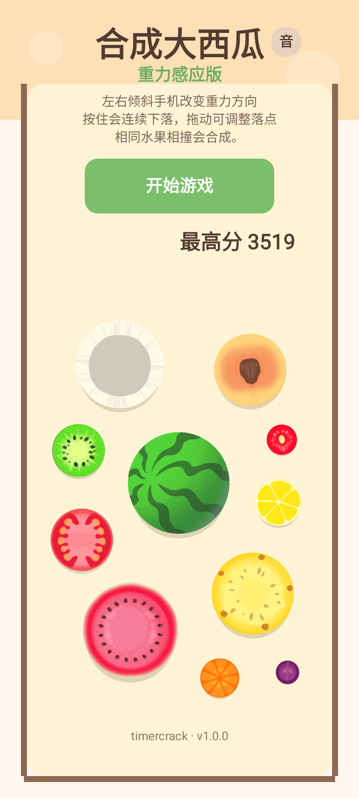
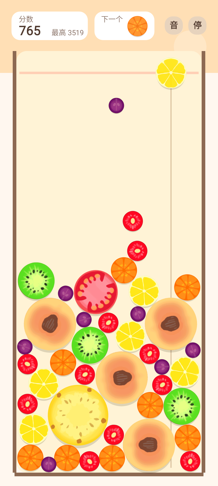

# SyntheticWatermelon

一个使用 **Kotlin + SurfaceView** 编写的 Android 原生“合成大西瓜”小游戏。

项目当前实现了基于自定义游戏循环的 2D 物理合成玩法，并结合了传感器重力、位图资源和音效资源。

## 演示截图

<p align="center">
	
	
</p>

## 功能特性

- 自定义 `SurfaceView` 渲染与游戏循环
- 触摸控制落点预览与水果投放
- 基于自定义物理规则的碰撞、堆叠与合成
- 设备重力 / 加速度传感器控制重力方向
- 音效播放与最高分本地持久化
- 纯 Android 原生实现，无游戏引擎依赖

## 技术栈

- Kotlin
- Android SDK 34
- Android Gradle Plugin 8.5.2
- JDK 17

## 项目结构

- `app/`：Android 应用模块
- `app/src/main/java/.../game/`：游戏渲染、输入、音频与状态逻辑
- `app/src/main/java/.../game/model/`：物理世界与水果数据模型
- `app/src/main/assets/game/`：水果图片与音频资源

## 本地运行

### 调试构建

1. 使用 Android Studio 打开仓库根目录。
2. 确保本机已安装 Android SDK，并且 `local.properties` 指向正确的 SDK 路径。
3. 执行调试构建：

```powershell
.\gradlew.bat assembleDebug
```

### Release 签名构建

如果你需要生成签名的 release 包：

1. 将 `keystore.properties.example` 复制为 `keystore.properties`
2. 填入你自己的签名信息
3. 将 `keystore.jks` 放到仓库根目录，或在 `storeFile` 中填写绝对路径
4. 执行：

```powershell
.\gradlew.bat exportReleaseApk
```

构建完成后，可导出发布包到 `build/release/合成大西瓜.apk`，当前版本号为 `1.0.0`。

## 许可证

本项目使用 [MIT License](LICENSE)。
